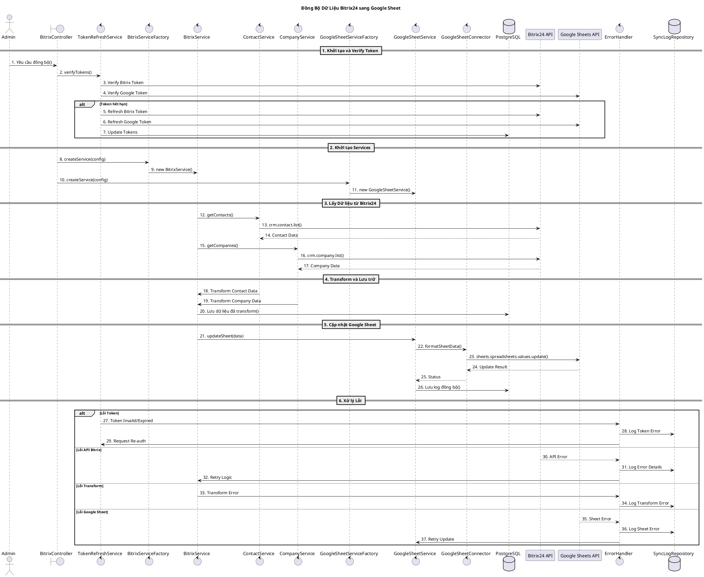

# Biểu Đồ Trình Tự Đồng Bộ

## 1. Đồng Bộ Bitrix24 sang Google Sheet


## 2. Đồng Bộ Google Sheet sang Bitrix24
```plantuml
@startuml
title Đồng Bộ Dữ Liệu Google Sheet sang Bitrix24

actor "Admin" as admin
boundary "GoogleSheetController" as sheetCtrl
control "GoogleSheetServiceFactory" as sheetFactory
control "GoogleSheetService" as sheetSrv
control "GoogleSheetConnector" as sheetCon
control "BitrixServiceFactory" as bitrixFactory
control "BitrixService" as bitrixSrv
control "ContactService" as contactSrv
control "CompanyService" as companySrv
database "PostgreSQL" as db
participant "Google Sheets API" as googleApi
participant "Bitrix24 API" as bitrixApi

== 1. Khởi tạo và Lấy Dữ liệu ==
admin -> sheetCtrl: 1. Yêu cầu đồng bộ()
sheetCtrl -> sheetFactory: 2. createService(config)
sheetFactory -> sheetSrv: 3. new GoogleSheetService()
sheetSrv -> sheetCon: 4. getSheetData()
sheetCon -> googleApi: 5. sheets.spreadsheets.values.get()
googleApi --> sheetCon: 6. Sheet Data
sheetCon -> sheetSrv: 7. Raw Data

== 2. Validate và Transform ==
sheetSrv -> sheetSrv: 8. validateData()
alt Dữ liệu Contact
    sheetSrv -> sheetSrv: 9. transformToContactFormat()
else Dữ liệu Company
    sheetSrv -> sheetSrv: 10. transformToCompanyFormat()
end
sheetSrv -> db: 11. Lưu dữ liệu tạm()
db --> sheetSrv: 12. Save Success

== 3. Cập nhật Bitrix24 ==
sheetSrv -> bitrixFactory: 13. createService(config)
bitrixFactory -> bitrixSrv: 14. new BitrixService()

alt Cập nhật Contact
    bitrixSrv -> contactSrv: 15. batchUpdate(contacts)
    contactSrv -> bitrixApi: 16. crm.contact.batch.update()
    bitrixApi --> contactSrv: 17. Update Results
else Cập nhật Company
    bitrixSrv -> companySrv: 18. batchUpdate(companies)
    companySrv -> bitrixApi: 19. crm.company.batch.update()
    bitrixApi --> companySrv: 20. Update Results
end

== 4. Xử lý Kết quả ==
bitrixSrv -> sheetSrv: 21. Sync Results
sheetSrv -> sheetCon: 22. updateSyncStatus()
sheetCon -> googleApi: 23. Update Status Cells()
googleApi --> sheetCon: 24. Update Complete
sheetSrv -> db: 25. Lưu log đồng bộ()
sheetSrv --> sheetCtrl: 26. Sync Complete
sheetCtrl --> admin: 27. Thông báo hoàn thành

== 5. Xử lý Lỗi ==
control "ErrorHandler" as error
database "SyncLogRepository" as syncLog

alt Lỗi Dữ liệu
    sheetSrv -> error: 28. Data Validation Error
    error -> sheetCon: 29. Mark Error Cells()
    sheetCon -> googleApi: 30. Update Error Cells()
else Lỗi Transform
    sheetSrv -> error: 31. Transform Error
    error -> syncLog: 32. Log Transform Error
else Lỗi API Bitrix
    bitrixApi --> error: 33. API Error
    error -> syncLog: 34. Log Error Details
    error -> bitrixSrv: 35. Retry Logic()
end

@enduml
